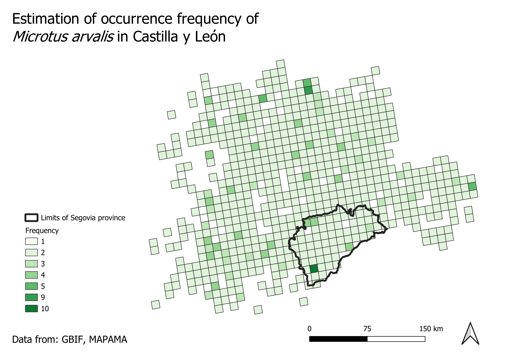

# Estimating the frequency of occurrence of _Microtus arvalis_

## Objective: 
> Have an approximation of _Microtus arvalis_ occurrence frequency in Castilla y León (Spain)

## Data sources:
### GBIF data (csv file)
- Reference: GBIF.org (25 September 2024) GBIF Occurrence Download [doi](https://doi.org/10.15468/dl.q6m323)
- Fields of interest: `decimalLongitude`, `decimalLatitude`
- Licensing: Non comercial use, must cite
- Processing:
```
 processing.run("native:createpointslayerfromtable", {'INPUT':'C:/Users/localuser/Documents/GIS data/Microtus_arvalis_5_1.csv','XFIELD':'decimalLongitude','YFIELD':'decimalLatitude','ZFIELD':'','MFIELD':'','TARGET_CRS':QgsCoordinateReferenceSystem('EPSG:4326'),'OUTPUT':'TEMPORARY_OUTPUT'})
```
- Temporary output made permanent as: `Microtus_arvalis_5_1.gpkg`

### Spanish species distribution grid (vector data)
- Reference: MAPAMA _Distribución de Especies Artículo 17 (periodo 2013-2018)_ [Download](https://www.mapama.gob.es/app/descargas/descargafichero.aspx?f=distribucion_especies_art17_2013_2018.zip)
- Fields of interest: `cell_code_`
- Licensing: Free use, must cite
- Coordinate system: `EPSG:4258 - ETRS89 - Geographic`
- File name: `ESArt17_EspeciesDistrib.shp`

## Step 1: Obtaining a clean grid of species distribution for Spain
The layer from MAPAMA has overlapping features, we want to have the features with unique geometry. 
```
 processing.run("native:deleteduplicategeometries", {'INPUT':'C:/Users/localuser/Documents/GIS data/distribucion_especies_art17_2013_2018/ESArt17_EspeciesDistrib.shp','OUTPUT':'ogr:dbname=\'C:/Users/localuser/Documents/GIS data/clean_grid.gpkg\' table="output" (geom)'})
```

## Step 2: Spatial join between the grid and the occurrences of the species
We are doing a join of one (one cell of the grid) to many (as many points that intercept with a cell). We want to keep at least one field from the point layer that has no blanks (AKA `null` values). We choose `fid` and `scientificName`.

```
 processing.run("native:joinattributesbylocation", {'INPUT':'C:/Users/localuser/Documents/GIS data/clean_grid.gpkg|layername=output','PREDICATE':[0],'JOIN':'C:/Users/localuser/Documents/GIS data/Microtus_arvalis_5_1.gpkg|layername=points_from_table','JOIN_FIELDS':['fid','scientificName'],'METHOD':0,'DISCARD_NONMATCHING':False,'PREFIX':'','OUTPUT':'ogr:dbname=\'C:/Users/localuser/Documents/GIS data/grid_microtus.gpkg\' table="grid_microtus" (geom)'})
```

## Step 3: Transformation of the attribute table to summarise the information
We currently have several rows for the same `cell_code_`. We want to obtain only one row per `cell_code_` and the number of times the `cell_code_` appeared. We are going to do this in Google Sheet. 
1. Copy all the rows in Google Sheet
2. Remove the rows that don't have information for the fields we used in the spatial Join (`fid_2` and `scientificName`)
   > **WE DID NOT DO THIS DURING THE SESSION**
4. Insert Pivot table. Choose all the data. Choose `cell_code_` as column and value. Then choose `COUNTA`.
5. Download the table as a .csv file: `microtus_arvalis_spainish_grid - Pivot Table 1.csv`. The names of the fields are: `cell_code_` and `COUNTA of cell_code_`

## Step 4: Join attribute tables
Add the csv file to the project. We are going to use the clean grid, which only has one geometry per `cell_code_`. In both the csv and the clean grid the field in common is called `cell_code_`.
```
processing.run("native:joinattributestable", {'INPUT':'C:/Users/localuser/Documents/GIS data/clean_grid.gpkg|layername=output','FIELD':'cell_code_','INPUT_2':'C:/Users/localuser/Downloads/microtus_arvalis_spainish_grid - Pivot Table 1.csv','FIELD_2':'cell_code_','FIELDS_TO_COPY':[],'METHOD':1,'DISCARD_NONMATCHING':False,'PREFIX':'','OUTPUT':'ogr:dbname=\'C:/Users/localuser/Documents/GIS data/grid_microtus_occurrences.gpkg\' table="grid_ma" (geom)'})
```

## Step 5: Obtain the count data as integer
The data has been joined as a string and it is not possible to use the continuous ramp for symbology. We need to create a new field that has the type integer and then pass the values to that new field. 
1. We toggle editing mode (`ctrl+E`)
2. We add a new field (`ctrl+W`), type: `integer`, name: `count_int`
3. In the field calculator (the bar between the buttons and the table) we indicate: `count_int = COUNTA of cell_code_` 

## Step 6: Change symbology of `grid_microtus_occurrences.gpkg`
Because of the small number of occurrences (the maximum is 10) we can use categorised symbols. Optionally: we remove the stroke of the geometries.

## Step 7: Create a layout with the resulting data
The map contains at least:
- scale bar
- North arrow
- Legend (with only the elements that appear on the map)
- the title
- reference to the data sources, at least the author/organisation. In this case: GBIF, MAPAMA


